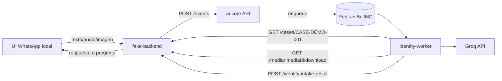
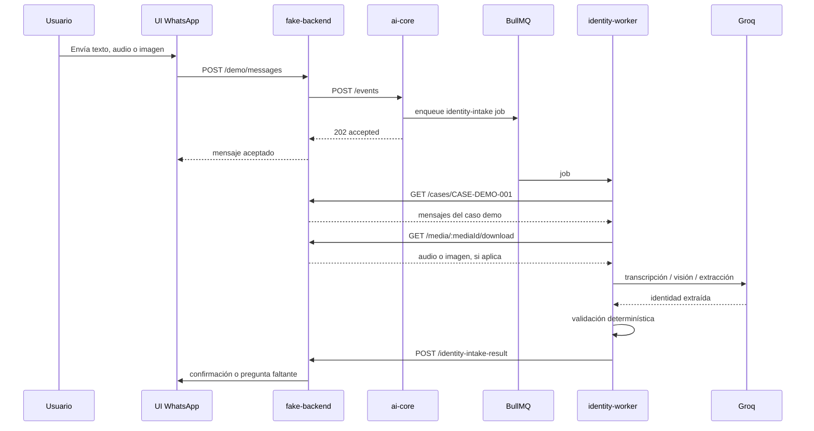

```
_____/\\\\\\\\\_____/\\\\\\\\\\\______________________/\\\\\\\\\_______/\\\\\_________/\\\\\\\\\______/\\\\\\\\\\\\\\\
 ___/\\\\\\\\\\\\\__\/////\\\///____________________/\\\////////______/\\\///\\\_____/\\\///////\\\___\/\\\///////////_
  __/\\\/////////\\\_____\/\\\_____________________/\\\/_____________/\\\/__\///\\\__\/\\\_____\/\\\___\/\\\____________
   _\/\\\_______\/\\\_____\/\\\______/\\\\\\\\\\\__/\\\______________/\\\______\//\\\_\/\\\\\\\\\\\/____\/\\\\\\\\\\\____
    _\/\\\\\\\\\\\\\\\_____\/\\\_____\///////////__\/\\\_____________\/\\\_______\/\\\_\/\\\//////\\\____\/\\\///////_____
     _\/\\\/////////\\\_____\/\\\___________________\//\\\____________\//\\\______/\\\__\/\\\____\//\\\___\/\\\____________
      _\/\\\_______\/\\\_____\/\\\____________________\///\\\___________\///\\\__/\\\____\/\\\_____\//\\\__\/\\\____________
       _\/\\\_______\/\\\__/\\\\\\\\\\\__________________\////\\\\\\\\\____\///\\\\\/_____\/\\\______\//\\\_\/\\\\\\\\\\\\\\\
        _\///________\///__\///////////______________________\/////////_______\/////_______\///________\///__\///////////////_

```

# SIGSA AI Core

Servicio IA desacoplado del backend para capturar póliza, nombre y apellido desde texto, audio o imagen.

## Arquitectura



## Flujo Demo



```bash
npm install
```

```bash
docker compose up -d redis
```


```bash
npm run dev:fake-backend
```


```bash
npm run dev:ai-core
```


```bash
npm run dev:identity-worker
```

```
ngrok http 3000
```

```txt
http://localhost:4000/whatsapp
```

```bash
curl.exe http://localhost:4000/identity-intake-results
```

El worker devuelve:

```txt
complete
```

```txt
needs_input
```